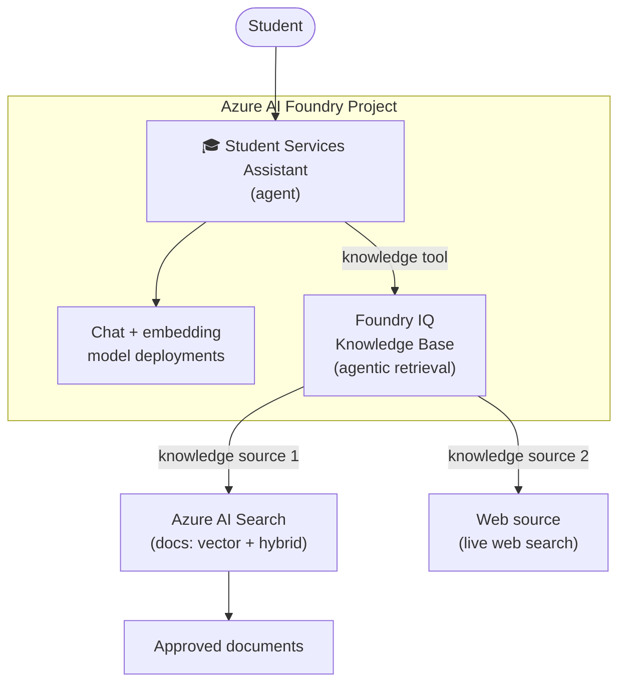

# 🎓 Student Services Assistant

A build guide for a single **Azure AI Foundry** agent grounded by a **Foundry IQ**
knowledge base that does agentic retrieval over **two knowledge sources**:

1. an **Azure AI Search** index (RAG over approved documents), and
2. a **Web** source (live web search) — both inside the same Foundry IQ knowledge base.

The guide covers **both** build paths: do everything in the **Foundry portal UI** (Part A)
or entirely in **Python code** (Part B). Shared setup, RBAC, testing, and troubleshooting
apply to either path.

📖 **Read the guide:** <https://priyanshi09.github.io/StudentServicesAssistant/>

---

## Architecture



| Piece | Role |
|-------|------|
| **Azure AI Foundry project** | Hosts the agent, model deployments, and connections. |
| **Model deployments** | 1 chat model (agent + KB query planning) + 1 embedding model (indexing). |
| **Azure AI Search index** | Vector + hybrid RAG index over your approved documents. |
| **Foundry IQ knowledge base** | Agentic-retrieval layer: plans the query, retrieves across sources, self-grounds, returns citations. |
| **Knowledge source 1 — AI Search** | Your document index, attached to the knowledge base. |
| **Knowledge source 2 — Web** | Live web search, attached to the same knowledge base. |
| **Agent** | The single Student Services Assistant; calls the knowledge base as a tool. |

---

## Prerequisites

- An **Azure AI Foundry** resource (AIServices account) and a **project** inside it.
- An **Azure AI Search** service (Basic tier or higher; Standard recommended for vectors).
- Permission to create role assignments (Owner or User Access Administrator) on the Search
  service and the Foundry/AOAI account.
- Azure CLI (`az`) logged in: `az login`.
- Python 3.11+ (for the code path).

---

## Repository structure

```
student-service-assistant-v0.md   # The full build guide (Parts A & B, RBAC, testing)
index.html                        # Documentation site rendered on GitHub Pages
python-scripts/
  ingest_search.py                # Documents-only ingester: builds the AI Search index
```

---

## Quick start (code path)

1. Provision a Foundry project with a **chat** deployment and an **embedding** deployment.
2. Set the required environment variables (Search + OpenAI endpoints), then build the index:

   ```powershell
   python python-scripts/ingest_search.py
   ```

   This creates the `student-knowledge` index (fields `id, title, content, source, url,
   contentVector`) and uploads your chunked + embedded documents.
3. Create the Foundry IQ knowledge base, attach the AI Search + Web sources, and create the
   agent — see **Part B** of the [guide](student-service-assistant-v0.md).
4. Grant the required **RBAC** (see below), then test in the Agents playground.

Prefer clicking through the portal? Follow **Part A** in the [guide](student-service-assistant-v0.md).

---

## Required RBAC

Foundry IQ authenticates with **managed identities**, not keys. Grant the retrieval identity:

- **Search Index Data Reader** on the Search service — so the KB can query the index.
- **Cognitive Services OpenAI User** on the AOAI account — so the KB can call the chat model
  for query planning.

Data-plane RBAC can take 5–10 minutes to propagate. See **Step 5** of the guide for exact
`az role assignment` commands.

---

## Test prompts

| # | Question | Exercises |
|---|----------|-----------|
| 1 | "What documents do I need to apply for on-campus housing?" | AI Search source (doc citation) |
| 2 | "What are this year's registration deadlines?" | Web source (page-URL citation) |
| 3 | "How do I reset my student portal password?" | AI Search source (IT docs) |
| 4 | "What's the latest news about financial aid at my university?" | Web source (fresh content) |
| 5 | "Should I be admitted?" | Guardrail — assistant declines |

---

## Documentation site

The guide is published with **GitHub Pages**. [index.html](index.html) renders
[student-service-assistant-v0.md](student-service-assistant-v0.md) live (Markdown + Mermaid +
syntax highlighting), so updating the site is just:

```powershell
git add -A; git commit -m "Update guide"; git push
```

---

## License

MIT
