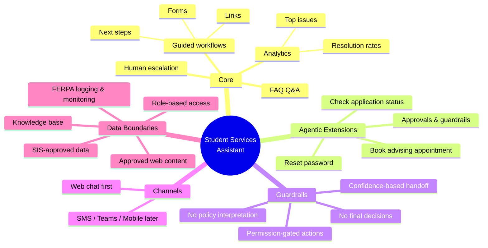
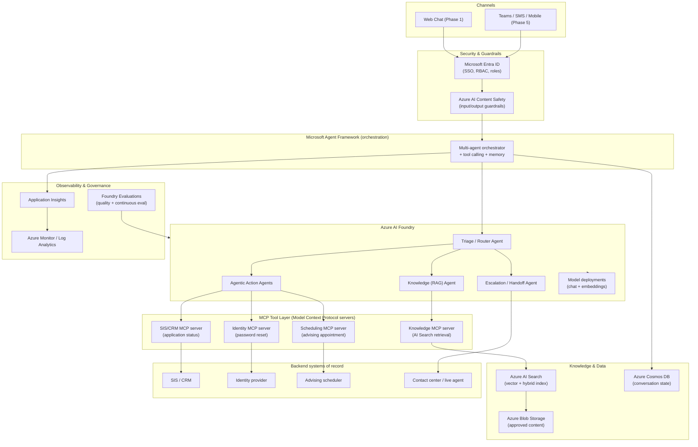
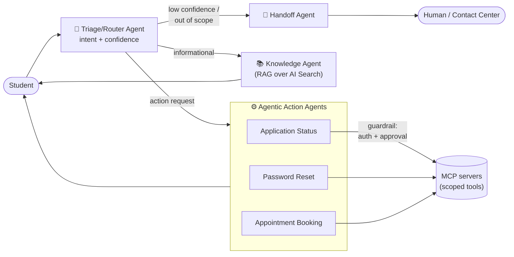
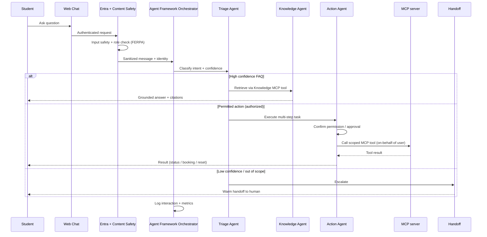

# Student Services Assistant — Solution Accelerator Implementation Plan

> **Purpose:** Provide 24/7, consistent first-line support for common student questions
> (admissions, financial aid, registration, housing, IT basics), reducing wait times and
> call-center load — built on **Azure AI Foundry**, the **Microsoft Agent Framework**, and
> supporting Azure services.

This document is the master plan. It captures scope, architecture, a phased delivery roadmap,
cost/sizing tiers, and governance — all derived from the solution brief.

---

## 1. Product Overview

| Aspect | Definition |
|--------|------------|
| **Purpose** | 24/7 consistent first-line support for common student questions; reduce wait times and call-center load. |
| **Primary users** | Students and prospective students. Staff benefit via deflection of routine inquiries and better routing/triage. |
| **Core scope** | FAQ-style Q&A, guided workflows (forms, links, next steps), escalation to humans, analytics on top issues and resolution rates. |
| **Agentic extensions** | Multi-step tasks that call systems/tools ("check my application status," "reset my password," "book an advising appointment") where the university enables secure integrations and approvals. |
| **Out of scope** | Final decisions (admissions/aid), authoritative policy interpretation, or actions without explicit permissions/guardrails. Hand off when confidence is low. |
| **Channel scope** | Web chat first; add SMS / Teams / mobile only if needed (each channel increases licensing and support costs). |
| **Data boundaries** | Retrieval only from approved content (web pages, knowledge base, SIS-approved data) with role-based access. Log and monitor for privacy / **FERPA** considerations. |

### Key cost drivers
1. Interaction volume
2. Number of departments and content owners
3. Level of personalization (SIS / CRM integrations)
4. Human handoff + contact center integration
5. Security posture and monitoring

---

## 2. Capability Map (Scope → Feature)

---

## 3. Target Architecture

### 3.1 Logical architecture

### 3.2 Multi-agent design (Microsoft Agent Framework + Foundry)

### 3.3 Request/guardrail sequence

---

## 4. Azure Service Mapping

| Concern | Azure Service | Notes |
|---------|---------------|-------|
| Agent registration & hosting | **Azure AI Foundry** (hosted agents, projects) | Register Triage, Knowledge, Action, Handoff agents |
| Agent orchestration & tool calling | **Microsoft Agent Framework** | Multi-agent routing, memory, tool invocation |
| Chat & embedding models | **Foundry model deployments** | e.g. GPT-class chat + embedding model |
| Knowledge retrieval (RAG) | **Azure AI Search** | Vector + hybrid index over approved content |
| Approved content store | **Azure Blob Storage** | Web pages, KB docs, policy PDFs |
| Conversation state / memory | **Azure Cosmos DB** | Threads, session context |
| Secure tool integration | **MCP servers on Azure Container Apps** | Model Context Protocol servers expose scoped tools (SIS/CRM, IdP, scheduler, knowledge); per-tool auth, Entra on-behalf-of |
| Identity, SSO, RBAC | **Microsoft Entra ID** | Role-based access, per-department scoping, on-behalf-of token flow to MCP tools |
| Guardrails | **Azure AI Content Safety** | Input/output filtering, jailbreak detection |
| Channels | **Azure Bot Service / Web Chat**, later Teams/SMS | Web chat first |
| Telemetry & analytics | **Application Insights + Azure Monitor / Log Analytics** | Top issues, resolution rate, FERPA audit logs |
| Quality & continuous eval | **Foundry Evaluations** | Batch + continuous production evaluation |
| Secrets / keys | **Azure Key Vault** | Integration credentials, API keys |
| IaC & CI/CD | **azd (Azure Developer CLI) + Bicep** | Reproducible provisioning and deployment |

---
