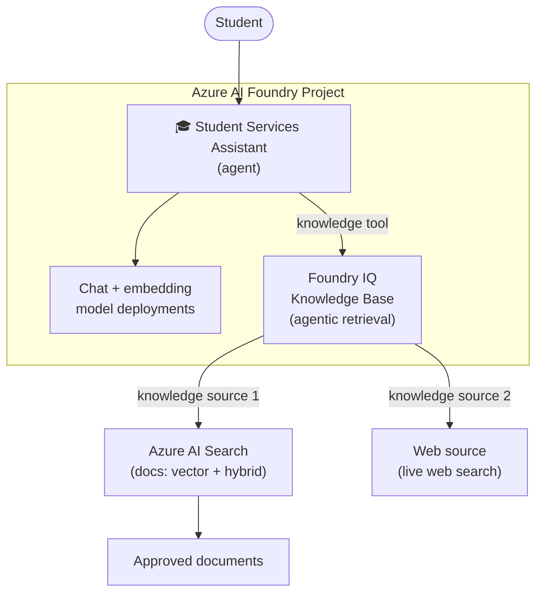

# Student Services Assistant — V0 Build Guide (Foundry IQ)

> **What you'll build:** A single **Azure AI Foundry agent** grounded by a **Foundry IQ
> knowledge base** that does agentic retrieval over **two knowledge sources**:
> 1. an **Azure AI Search** index (RAG over approved documents), and
> 2. a **Web** source (live web search) — both inside the same Foundry IQ knowledge base.
>
> This guide covers **both** ways to build it. Do everything in the **UI** (Foundry portal
> click-through) in **Part A**, or do everything in **Code** (Python SDK) in **Part B**. The
> shared setup (Parts 1–2) and RBAC/test/troubleshooting (Parts 5–8) apply either way.

---

## 0. What each piece does

| Piece | Role |
|-------|------|
| **Azure AI Foundry project** | Hosts the agent, model deployments, and connections. |
| **Model deployments** | 1 chat model (agent + KB query planning) + 1 embedding model (indexing). |
| **Azure AI Search index** | Vector + hybrid RAG index over your approved documents. |
| **Foundry IQ knowledge base** | The agentic-retrieval layer. Plans the query, retrieves across its knowledge sources, self-grounds, returns citations. |
| **Knowledge source 1 — AI Search** | Your document index, attached to the knowledge base. |
| **Knowledge source 2 — Web** | Live web search, attached to the same knowledge base. |
| **Agent** | The single Student Services Assistant; calls the knowledge base as a tool. |



---

## 1. Prerequisites

- An **Azure AI Foundry** resource (AI Services / AIServices account) and a **project** inside it.
- An **Azure AI Search** service (Basic tier or higher; Standard recommended for vectors).
- Permissions to create role assignments (Owner or User Access Administrator) on the Search
  service and the Foundry/AOAI account — you'll need these for the RBAC in **Step 6**.
- Azure CLI (`az`) logged in: `az login`.

> **Region tip:** Keep the Foundry project, model deployments, and Search service in the same
> region where possible to avoid cross-region latency and connection friction.

---

## 2. Provision the Foundry project & models

1. Go to the **Azure AI Foundry portal** → your project (or **+ Create project**).
2. Under **Models + endpoints → + Deploy model**, deploy:
   - A **chat** model (e.g., `gpt-5-mini` / `gpt-4o-mini`) — used by the agent **and** by
     Foundry IQ for query planning.
   - An **embedding** model (e.g., `text-embedding-3-small`) — used to vectorize documents.
3. Note the **project endpoint** (Project → **Overview → Endpoints**), e.g.
   `https://<account>.services.ai.azure.com/api/projects/<project>`.

---

## 3. Build via UI (Foundry portal) — Part A

Do all four build steps in the portal. (RBAC in **Step 5** and testing in **Step 6** are shared.)

### 3.1 Build the Azure AI Search index (RAG documents)
1. Azure portal → your **Search service → Import and vectorize data**.
2. Point it at your Blob container of approved docs.
3. Choose your Azure OpenAI **embedding** deployment for vectorization.
4. Finish — it creates an index + indexer and runs the first ingestion.

### 3.2 Create the Foundry IQ knowledge base + AI Search source
1. In the Foundry portal, open your project → **Knowledge** (a.k.a. **Knowledge bases** /
   **Foundry IQ**) → **+ New knowledge base**.
2. Give it a name (e.g., `student-services-kb`).
3. **Add a knowledge source → Azure AI Search**:
   - **Connection:** select or create a connection to your Search service
     (the project stores this as a connection, e.g. `searchconn`).
   - **Index:** choose your index (`student-knowledge`).
   - **Fields mapping:** map the **content** field and the **title/url** fields so citations
     resolve to a document name and link.
   - **Query type:** `simple` or `semantic`/`vector` depending on your index.
4. **Completion model:** select the **chat** deployment from Step 2 — Foundry IQ uses it to
   plan the query and synthesize the grounded answer.
5. **Save**. Test retrieval in the knowledge base's built-in **Test/Playground** pane with a
   document question (e.g., *"What documents do I need for on-campus housing?"*).

### 3.3 Add the Web source (web search)
1. Open the **same knowledge base** → **Add a knowledge source → Web**
   (labeled **Web search** / **Grounding with Web**).
2. Configure scope:
   - Optionally restrict to **approved domains** (e.g., `jmu.edu`, `*.myuniversity.edu`) so the
     assistant only grounds on trusted pages.
   - Set the **max results / freshness** if offered.
3. If prompted, pick/create the **connection** the web source uses (e.g., a Grounding-with-Bing
   or web-search connection in your project).
4. **Save**. Now the knowledge base has **two sources** — documents (AI Search) **and** web.
5. Test with a time-sensitive question (e.g., *"What are this year's registration deadlines?"*)
   and confirm the answer cites a **web page URL**.

### 3.4 Create the agent & attach the knowledge base
1. Foundry portal → project → **Agents → + New agent**.
2. **Model:** select your chat deployment from Step 2.
3. **Instructions** (system prompt), for example:
   ```
   You are the Student Services Assistant. Answer ONLY from grounded knowledge returned by
   the knowledge base. Always include citations. If the answer isn't grounded, say you don't
   know and suggest contacting the relevant office. Do not make admissions or financial-aid
   decisions.
   ```
4. **Tools / Knowledge → Add** → select your **Foundry IQ knowledge base** (`student-services-kb`).
   This wires both the AI Search and Web sources through one tool.
5. **Save**.

---

## 4. Build via Code (Python SDK) — Part B

The same four build steps in Python. Run these once your project + models (Step 2) exist.

### 4.1 Build the Azure AI Search index (ingestion script)
This repo ships a **documents-only** ingester for this guide (web comes from Foundry IQ in
Step 4.3, so the index holds documents only):

```powershell
# from the repo root, with env vars set (AZURE_SEARCH_ENDPOINT, AZURE_OPENAI_ENDPOINT, ...)
python scripts/ingest_search.py
```

It creates the `student-knowledge` index with fields
`id, title, content, source, url, contentVector` and uploads your `./data` markdown
(chunked + embedded). The core of it:

```python
from azure.identity import DefaultAzureCredential
from azure.search.documents import SearchClient
from azure.search.documents.indexes import SearchIndexClient
# create_or_update_index(...) with a vector (HNSW) + semantic config, then:
client = SearchClient(endpoint=SEARCH_ENDPOINT, index_name=INDEX_NAME, credential=DefaultAzureCredential())
client.upload_documents(documents=payload)  # payload rows include the contentVector embedding
```

> If you also want website pages **inside the index** (instead of a Foundry IQ web source),
> use `scripts/ingest.py` instead — it crawls `KNOWLEDGE_WEBSITE_URLS` into the same index.
> That's an alternative to Step 4.3.

### 4.2 Create the knowledge base + AI Search source
Attach the Search index as a knowledge source and give the KB a completion model. Using the
projects SDK + Search knowledge-base APIs (package/preview names may vary by version):

```python
from azure.identity import DefaultAzureCredential
from azure.ai.projects import AIProjectClient

project = AIProjectClient(
    endpoint="https://<account>.services.ai.azure.com/api/projects/<project>",
    credential=DefaultAzureCredential(),
)

# 1) Ensure the project has a connection to the Search service (portal or SDK).
search_conn = project.connections.get("searchconn")

# 2) Create a knowledge base whose first source is the AI Search index,
#    with a chat deployment as the completion (query-planning) model.
kb = project.knowledge_bases.create_or_update(
    name="student-services-kb",
    completion_model="gpt-5-mini",           # your chat deployment from Step 2
    sources=[
        {
            "kind": "azureAISearch",
            "connectionId": search_conn.id,
            "indexName": "student-knowledge",
            "queryType": "semantic",
            "fieldsMapping": {"contentFields": ["content"], "titleField": "title", "urlField": "url"},
        }
    ],
)
print("knowledge base:", kb.name)
```

### 4.3 Add the Web source
Add a second source of kind `web` to the existing knowledge base:

```python
# reuse `project` and the existing knowledge base from Step 4.2
web_conn = project.connections.get("groundingwithbing")  # your web-search connection

project.knowledge_bases.add_source(
    name="student-services-kb",
    source={
        "kind": "web",
        "connectionId": web_conn.id,
        "allowedDomains": ["jmu.edu", "*.myuniversity.edu"],   # optional scoping
        "maxResults": 5,
    },
)
print("web source added")
```

> **How agentic retrieval chooses:** Foundry IQ decomposes the question and retrieves from
> **both** sources, then grounds the answer — you don't write routing code. Document questions
> tend to resolve from the AI Search index; open/time-sensitive ones pull from the web source.

### 4.4 Create the agent & attach the knowledge base
Create the agent and attach the knowledge base as a tool. This mirrors
[src/api/app/foundry_agent.py](../src/api/app/foundry_agent.py) in this repo:

```python
INSTRUCTIONS = (
    "You are the Student Services Assistant. Answer ONLY from grounded knowledge returned by "
    "the knowledge base. Always include citations. If the answer isn't grounded, say you don't "
    "know and suggest contacting the relevant office. Do not make admissions/aid decisions."
)

agent = project.agents.create_agent(
    model="gpt-5-mini",                       # your chat deployment
    name="student-services-assistant",
    instructions=INSTRUCTIONS,
    tools=[{"type": "knowledge_base", "knowledge_base": {"name": "student-services-kb"}}],
)
print("agent id:", agent.id)

# invoke it
thread = project.agents.threads.create()
project.agents.messages.create(thread_id=thread.id, role="user",
                               content="What documents do I need for on-campus housing?")
run = project.agents.runs.create_and_process(thread_id=thread.id, agent_id=agent.id)
for m in project.agents.messages.list(thread_id=thread.id):
    print(m.role, m.content)
```

> **SDK caveat:** method/parameter names track the installed `azure-ai-projects` /
> Search knowledge-base preview. If a call differs (e.g., `knowledge_base` tool or
> `knowledge_bases.*` isn't in your build), mirror the **UI fields** in Part A —
> connection id, index name, query type, fields mapping, completion model — and/or attach the
> Azure AI Search index directly as a hosted `azure_ai_search` tool (see `foundry_agent.py`).

> **Keyless note:** If your Search service has `disableLocalAuth = true` (Entra-only),
> indexing and querying require **RBAC roles**, not keys — see **Step 5**.

---

## 5. Grant the required RBAC (the part that causes 401s)

Foundry IQ authenticates with **managed identities**, not keys. Two grants are typically
required; both were real blockers when building this project.

**(a) Let the knowledge base query the AI Search index.**
The identity that runs retrieval (the **Search service** managed identity, or the project MI,
depending on setup) needs a data-plane role on the Search service:

```powershell
$search = "/subscriptions/<sub>/resourceGroups/<rg>/providers/Microsoft.Search/searchServices/<search-name>"
az role assignment create --assignee-object-id <retrieval-identity-objectId> `
  --assignee-principal-type ServicePrincipal `
  --role "Search Index Data Reader" --scope $search
```

**(b) Let the knowledge base call the chat model for query planning.**
The retrieval identity also invokes your **chat deployment**. Without OpenAI inference rights it
fails with: *"lacks the required data action …/chat/completions/action"*. Fix:

```powershell
$aoai = "/subscriptions/<sub>/resourceGroups/<rg>/providers/Microsoft.CognitiveServices/accounts/<aoai-account>"
az role assignment create --assignee-object-id <retrieval-identity-objectId> `
  --assignee-principal-type ServicePrincipal `
  --role "Cognitive Services OpenAI User" --scope $aoai
```

**Find the retrieval identity's object id.** If the Search service has a system-assigned
identity, that's usually it:

```powershell
az search service show -n <search-name> -g <rg> --query identity.principalId -o tsv
# or resolve any principalId seen in an error message:
az ad sp show --id <principalId> --query "{name:displayName, type:servicePrincipalType}" -o json
```

> Data-plane RBAC can take **5–10 minutes** to propagate. Re-test in a fresh thread after
> granting.

---

## 6. Test in the Agents playground

Open the agent's **playground** and run:

| # | Question | Should exercise |
|---|----------|-----------------|
| 1 | "What documents do I need to apply for on-campus housing?" | AI Search source (doc citation) |
| 2 | "What are this year's registration deadlines?" | Web source (page-URL citation) |
| 3 | "How do I reset my student portal password?" | AI Search source (IT docs) |
| 4 | "What's the latest news about financial aid at my university?" | Web source (fresh content) |
| 5 | "Should I be admitted?" | Guardrail — assistant declines |

Confirm each answer shows **citations** and that the sources match expectations.

---

## 7. Troubleshooting (issues we actually hit)

| Symptom | Cause | Fix |
|---------|-------|-----|
| `401 Unauthorized` connecting to the Search MCP/KB endpoint; service has `disableLocalAuth=true` | Search service is **Entra-only**; api-key rejected and identity has no data-plane role | Grant **Search Index Data Reader** (Step 5a). Do **not** send an `api-key`. |
| `knowledge_base_retrieve` → *"principal … lacks …/chat/completions/action"* | Retrieval identity can't call the chat model | Grant **Cognitive Services OpenAI User** on the AOAI account (Step 5b) |
| Answers never cite the web / no fresh info | Web source not attached, or domain filter too strict | Re-check Step 3.3 / 4.3; loosen approved-domain scope |
| Citations point at the search endpoint, not the doc URL | Fields mapping missing `url`/`title` | Fix the AI Search source **fields mapping** (Step 3.2 / 4.2) |
| Retrieval works in KB test but agent returns "I don't know" | Knowledge base not attached to the agent | Re-attach it to the agent (Step 3.4 / 4.4) |
| RBAC granted but still 401 | Propagation delay | Wait 5–10 min, retry in a new thread |

---

## 8. Next steps

- Add an **MCP tool** (e.g., `get_application_status`) for live actions.
- Split the single agent into **Triage → Knowledge → Action → Handoff** agents.
- Add **Application Insights** + **Foundry Evaluations** for quality and analytics.
